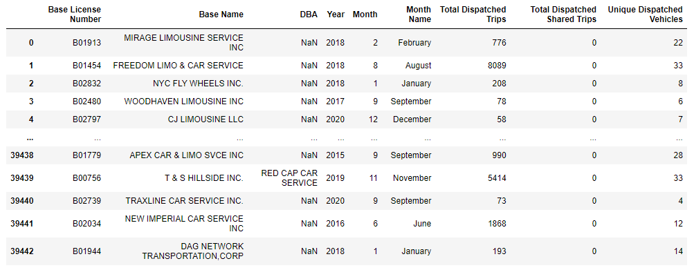
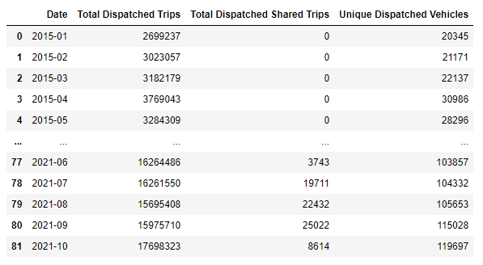
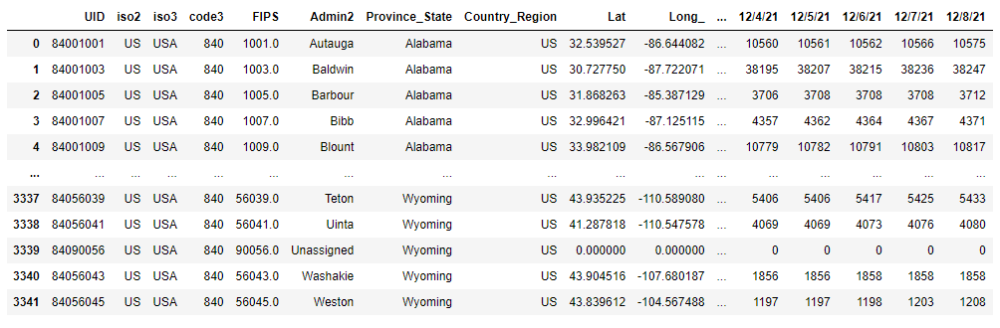
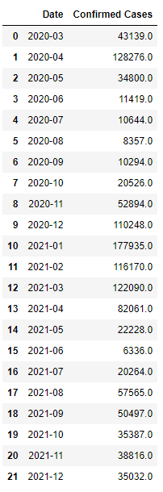

# NYC FHV Statistical Analysis

## Summary
After a conversation about transportation with my mentor, I became curious on how Covid-19 affected the For-Hire-Vehicle services (Uber, Lyft, etc). Using the Taxi and Limousine Commission's aggregate report and John Hopkins University's Covid-19 dashboard, I put the data into Python and Power Bi to be able to see the impact of the pandemic on the industry.

## Motivation
When I first dove into programming in summer of 2021, I had the privilege of being introduced to my mentor. Throughout the remainder of 2021, him and I would meet over Zoom and discuss not only my learning, but how my life was going. In turn, I would do the same for him. One morning we were discussing how transportation for him was tricky since Covid-19 began.

I live in a much smaller area than New York City, and never really considered the impact the Covid-19 virus had on services like Uber and Lyft. While those services are available where I live, it’s common to already own a vehicle(s). On top of this, NYC (and the state of New York) were put on many restrictions and handed many guidelines on how to handle the pandemic. Where I live, not so much.
After my mentor and I had this conversation, I became curious.

## Data Questions
Going into this project, I had the overarching question:

**What impact did Covid-19 have on the For-Hire-Vehicle industry in NYC?**

Once I dove deeper into the data, more questions started to enter my head, including:

How were trips before the pandemic? What about once it started? How was “ride sharing” affected? And how many vehicles were still completing trips?

## Data Sources
[TLC's FHV Base Aggregate Report](https://data.cityofnewyork.us/Transportation/FHV-Base-Aggregate-Report/2v9c-2k7f)

[New York State Governor's Website for Covid-19 Policies](https://www.governor.ny.gov/keywords/coronavirus)

John Hopkins University's GitHub repos for their Covid-19 Dashboard:

https://github.com/CSSEGISandData/COVID-19/tree/master/csse_covid_19_data/csse_covid_19_daily_reports

https://github.com/govex/COVID-19/tree/master/data_tables/vaccine_data/us_data

## Tools Used

Tools used:

Python – Data was cleaned and merged to be able to create a Power BI dashboard and find further analysis.

Power BI – Data cleaned in Python was used to create an interactive dashboard that allowed users to mix and match key statistics over user set date ranges.

MS PowerPoint – Used to help storyboard and showcase data analysis.

## Known Issues and Challenges

Issues with number reporting:

•	The TLC’s report aggregates monthly numbers and is on a two-month publishing delay.

•	JHU’s Covid-19 data aggregates are daily and a running total instead of the amount during the day.

To fix this, I had to find a way to format both datasets in a manner that would allow them to fit together. Since monthly is as far as I’m able to drill down in the TLC report, I decided to have that be the base time scale. Since JHU’s numbers are reported daily and as a running total, I needed a way to get the last day of the month’s numbers and subtract it from the previous month’s last day numbers.

### FHV dataset
My FHV dataset began like this -

In the end I turned it into this -

### JHU datasets
The Covid-19 data was tricky. I had to turn this -

Into something like this -

Once everything was transformed and merged, I was able to put this dataset into Power Bi to create an interactive dashboard, which can be found [here](https://app.powerbi.com/view?r=eyJrIjoiYmY0MzkzMzktOGM2Ni00NTY3LWI3Y2MtY2E0OTJlMzNhZTA2IiwidCI6IjEwMWRhNTg3LTE4NDMtNGY1Mi04YjhhLTE3YjA2OWM2NmQzMyIsImMiOjJ9).

## Acknowledgements
Special thanks and much love to NSS and these individuals:

•	**Hank Ballew** – For being a life changer for me. With his help, I was able to begin my journey into programming and attend NSS.

•	**Colfax Selby** – For being the best mentor a guy could ask for. I look forward to continuing my learning and professional career with him.

•	**Chris Wright** – For being a terrific lead instructor and giving me first glimpses of the technologies and techniques I used in this project and others.

•	**Joshua Rio-Ross** – For being fantastic at explaining issues I faced in my learning and being an amazing go-to for troubleshooting problems.

•	**Toni Kim and Chip Hubbard** – While my time with both was short, I fully appreciate all the guidance and help they have given me throughout my time at NSS.
